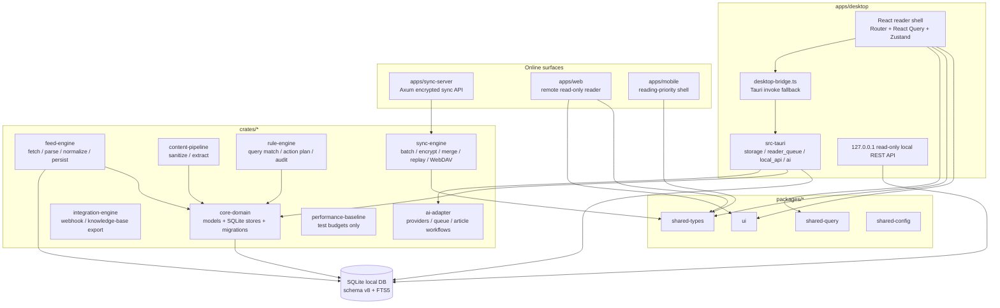

# FreelyRSS 架构说明

## 1. 文档定位

本文档是 FreelyRSS 当前代码架构的快速接手入口，以仓库实际实现为准。产品愿景看 [RSS-design-document.md](./RSS-design-document.md)，技术取舍看 [tech-stack.md](./tech-stack.md)，历史执行清单看 [implementation-plan.md](./implementation-plan.md)，当前状态看 [progress.md](./progress.md)。

本文档刻意不保存逐 Step 历史。里程碑流水账已删除，只保留当前代码结构、运行链路、数据库 schema、模块边界和仍需注意的风险。

## 2. 总体架构图

## 3. 运行时事实

- 桌面端是本地优先主机。Tauri 启动时会通过 `apps/desktop/src-tauri/src/storage.rs` 创建运行目录、初始化 SQLite，并通过 `local_api.rs` 启动 loopback-only、bearer-token、只读本地 REST API。
- 桌面 UI 的主入口是 `apps/desktop/src/App.tsx` 和 `features/reader-shell/reader-shell-route.tsx`。它使用共享 UI、共享类型、共享查询模型、React Query、TanStack Router 和 Zustand。
- 桌面 reader shell 目前仍保留 `mock-data.ts` 作为 UI/dev/test 数据源。`desktop-bridge.ts` 会优先尝试 Tauri durable 命令加载真实队列和 AI 结果，失败时回退到 mock。
- 本地数据库是客户端业务事实来源。远程同步服务不得复制桌面完整业务 schema，也不得作为桌面 UI 主数据源。
- Web 端是远程同步阅读入口，目前由 `apps/web/src/remote-client.ts` 提供 remote snapshot mock，显式禁止本地抓取、桌面 SQLite、Tauri 命令、本地 AI、本地 REST、缓存维护和复杂规则编辑。
- 移动端是阅读优先入口，目前由 `apps/mobile/src/mobile-client.ts` 与平台 snapshot mock 驱动，显式禁止导入桌面 Tauri/SQLite/FeedEngine/本地 REST 职责。

## 4. 代码目录边界

| 路径 | 当前职责 | 不应承担 |
| --- | --- | --- |
| `apps/desktop` | 桌面主 UI、Tauri host、SQLite 初始化、reader queue、AI 命令、本地只读 REST API、桌面验证 | 远程同步服务、生产 AI provider SDK、Web/mobile 平台职责 |
| `apps/web` | 远程同步阅读入口、远程快照过滤、只读文章详情展示、Web scope contract | 本地抓取、桌面 SQLite/Tauri、本地缓存、AI 生成、Webhook、知识库导出 |
| `apps/mobile` | Expo 阅读壳、移动 scope contract、离线缓存/媒体/分享模型、移动 selector 测试 | 桌面批处理、OPML 管理、复杂规则编辑、Tauri/SQLite、本地 REST |
| `apps/sync-server` | Axum 最小同步 API，账号/设备、加密事件、加密 blob 元数据 | 业务文章/订阅 REST API，明文 payload，桌面 SQLite 镜像 |
| `packages/ui` | Button、List、SplitLayout、Surface、TextInput、ThemeRoot 和主题 CSS | 业务状态、平台 host 逻辑 |
| `packages/shared-types` | 跨端 DTO、枚举、id、同步字段边界 | 数据访问、运行时存储 |
| `packages/shared-query` | 查询 AST、文本解析、JSON 序列化、校验、SQL plan | 规则动作执行、SQLite 连接 |
| `packages/shared-config` | 默认配置、环境变量解析、代理、合并与校验 | 秘钥存储、远程配置服务 |
| `crates/core-domain` | Rust 领域模型、SQLite 迁移、stores、FTS、备份恢复 | HTTP 抓取、UI 状态、远程服务路由 |
| `crates/feed-engine` | transport、parser、normalizer、SQLite repository、feed fixture 回归 | Reader UI、同步协议、AI 任务 |
| `crates/content-pipeline` | HTML 清洗、正文提取、内容模型 | 订阅树管理、同步协议 |
| `crates/rule-engine` | 查询匹配、规则动作计划、规则审计输入 | 独立查询语法、直接 UI 操作 |
| `crates/search-engine` | 预留搜索 crate 边界 | 当前不要复制 `core-domain` 的 FTS 实现 |
| `crates/sync-engine` | 事件批次、游标、加密、重放、合并、重试、WebDAV 对象存储 | 业务主数据库、UI 视图状态 |
| `crates/integration-engine` | 集成适配器、noop、Webhook、知识库导出 | 本地核心模型扩展字段、reader UI provider 逻辑 |
| `crates/ai-adapter` | AI provider trait、registry、queue、mock provider、摘要/翻译/问答工作流 | 自动启用 AI、改写原文、同步明文模型输出 |
| `crates/performance-baseline` | 100 feeds / 10,000 articles 等确定性性能预算测试 | 运行时代码依赖、生产遥测 |

## 5. 关键数据流

### 5.1 桌面启动

1. Tauri `run()` 调用 `storage::setup_local_storage(app)`。
2. `storage.rs` 从 `app.path().app_local_data_dir()` 派生运行目录。
3. 创建 `database/`、`database/backups/`、`cache/content/`、`cache/media/`、`exports/`、`logs/`。
4. `core-domain::sqlite::initialize_database` 打开 SQLite，启用 `foreign_keys`、`WAL`、5 秒 busy timeout，并执行嵌入式迁移。
5. `local_api::setup_local_api(app)` 在 `127.0.0.1:0` 启动只读本地 API，并把随机 token 放入 Tauri state。

### 5.2 阅读队列与搜索

1. UI 通过 route search、Zustand 视图状态和共享 query 构建当前来源、搜索、排序、状态过滤。
2. Tauri 命令 `load_reader_queue_articles` 使用 `ArticleSearchStore::list_articles` 读取 SQLite/FTS。
3. 如果 Tauri invoke 不可用，桌面 UI 使用 `mock-data.ts` 保持开发和 jsdom 测试路径可运行。

### 5.3 Feed 摄取

1. `FeedFetcher` 通过 `FeedTransport` 拉取源。
2. `DefaultFeedParser` 解析 RSS、Atom、JSON Feed 或 HTML discovery。
3. `DefaultFeedNormalizer` 输出标准化 Feed、Article、Attachment 记录。
4. `SqliteFeedRepository` / `FeedStore` 写入 `Feed`、`Article`、`Attachment`，并创建默认 `UserState`。
5. 去重依赖 `source_guid`、canonical/original URL、`title + published_at`、`content_hash` 索引。

### 5.4 AI 操作

1. Reader UI 必须由用户显式开启并触发 AI 操作。
2. Tauri 命令读取本地 SQLite 文章内容，调用 `ai-adapter` 的 deterministic mock provider。
3. 摘要、关键词、翻译、问答结果写入 `AIArtifact`，使用 `input_hash` 复用缓存。
4. AI 结果是派生数据，可以删除，不覆盖原始文章。

### 5.5 同步

1. 客户端本地模型通过 `SyncEvent` 记录可携带状态和组织结构变化。
2. `sync-engine` 负责打包、游标、加密、合并、重放、重试和 WebDAV 对象存储。
3. 远程 `sync-server` 只接受加密事件和加密 blob 元数据。
4. 服务端测试明确拒绝业务实体 API 和明文 sync payload。

## 6. 数据库 Schema v8

Schema 由 `crates/core-domain/src/sqlite/migrations.rs` 管理。当前最新版本为 8，迁移文件位于 `crates/core-domain/src/sqlite/migrations/`。除 `schema_migrations` 由迁移框架创建外，其余业务结构均来自编号 SQL 文件。

### 6.1 迁移线

- `001_bootstrap_metadata.sql`：`app_metadata`
- `002_core_business_tables.sql`：核心业务表
- `003_core_business_indexes.sql`：核心索引与唯一约束
- `004_article_search_fts.sql`：`ArticleSearchSource` view、`ArticleSearch` FTS5、同步触发器
- `005_article_dedup_indexes.sql`：文章去重索引
- `006_feed_health_diagnostics.sql`：Feed 错误诊断字段和索引
- `007_rule_audit_history.sql`：`RuleAudit`
- `008_feed_cache_policy.sql`：`Feed.cache_policy`

### 6.2 表与字段

| 表 / 视图 | 字段 |
| --- | --- |
| `schema_migrations` | `version`, `name`, `applied_at` |
| `app_metadata` | `key`, `value`, `updated_at` |
| `Folder` | `id`, `name`, `parent_id`, `sort_order`, `kind` |
| `Tag` | `id`, `name`, `scope`, `color`, `created_at` |
| `Feed` | `id`, `title`, `site_url`, `feed_url`, `format`, `icon`, `folder_id`, `custom_name`, `sort_order`, `update_interval`, `health_status`, `last_checked_at`, `last_success_at`, `etag`, `last_modified`, `last_error_kind`, `last_error_message`, `last_error_at`, `consecutive_failures`, `cache_policy` |
| `Article` | `id`, `feed_id`, `source_guid`, `title`, `author`, `summary`, `content_raw`, `content_extracted`, `canonical_url`, `original_url`, `published_at`, `fetched_at`, `language`, `thumbnail`, `word_count`, `content_hash` |
| `FeedTag` | `feed_id`, `tag_id` |
| `ArticleTag` | `article_id`, `tag_id` |
| `Attachment` | `id`, `article_id`, `type`, `url`, `mime_type`, `duration`, `size`, `local_cache_path` |
| `UserState` | `article_id`, `read_state`, `starred`, `liked`, `importance`, `read_later`, `reading_progress`, `last_opened_at` |
| `Annotation` | `id`, `article_id`, `type`, `selected_text`, `anchor`, `note`, `color`, `created_at` |
| `Rule` | `id`, `name`, `enabled`, `priority`, `conditions`, `actions`, `scope` |
| `SmartFolder` | `id`, `name`, `query_definition`, `sort_definition` |
| `RuleAudit` | `id`, `rule_id`, `article_id`, `match_result`, `input_snapshot`, `planned_commands`, `applied_effects`, `created_at` |
| `AIArtifact` | `id`, `article_id`, `kind`, `provider`, `input_hash`, `result`, `created_at` |
| `SyncEvent` | `id`, `entity_type`, `entity_id`, `change_type`, `payload`, `device_id`, `created_at` |
| `ArticleSearchSource` | `article_rowid`, `article_id`, `feed_id`, `title`, `summary`, `content`, `author`, `feed_title`, `tag_names` |
| `ArticleSearch` | `article_id`, `feed_id`, `title`, `summary`, `content`, `author`, `feed_title`, `tag_names` |

### 6.3 约束

- 所有业务表使用 SQLite `STRICT`。
- 外键：`Folder.parent_id -> Folder.id`，`Feed.folder_id -> Folder.id`，`Article.feed_id -> Feed.id`，`FeedTag`/`ArticleTag` 指向各自主表，`Attachment`/`UserState`/`Annotation`/`AIArtifact` 指向 `Article.id`，`RuleAudit` 指向 `Rule.id` 和 `Article.id`。
- 复合主键：`FeedTag(feed_id, tag_id)`，`ArticleTag(article_id, tag_id)`。
- 枚举约束：
  - `Feed.format`: `rss`, `atom`, `json-feed`
  - `Feed.health_status`: `pending`, `healthy`, `degraded`, `error`, `paused`
  - `Feed.last_error_kind`: `network`, `permission`, `parse`, `empty`
  - `Feed.cache_policy`: `metadata-only`, `content`, `content-and-attachments`
  - `Folder.kind`: `regular`, `system`, `group`
  - `Tag.scope`: `feed`, `article`
  - `Attachment.type`: `image`, `audio`, `video`, `file`
  - `UserState.read_state`: `unread`, `reading`, `read`
  - `UserState.importance`: `low`, `normal`, `high`
  - `Annotation.type`: `highlight`, `note`, `comment`
  - `RuleAudit.match_result`: `matched`, `not-matched`
  - `AIArtifact.kind`: `summary`, `keywords`, `translation`, `question-answer`
- 布尔字段以 `0/1` 存储：`UserState.starred`, `UserState.liked`, `UserState.read_later`, `Rule.enabled`。
- `UserState.reading_progress` 必须在 `0.0..=1.0`。
- `Feed.consecutive_failures` 必须 `>= 0`。

### 6.4 索引与 FTS

唯一索引：

- `ux_feed_feed_url` on `Feed(feed_url)`
- `ux_tag_scope_name` on `Tag(scope, name)`

普通索引：

- `idx_folder_parent_id_sort_order`
- `idx_feed_folder_id_sort_order`
- `idx_feed_health_status_last_checked_at`
- `idx_feed_last_error_kind_last_checked_at`
- `idx_feed_consecutive_failures_last_checked_at`
- `idx_article_feed_id_source_guid`
- `idx_article_feed_id_published_at`
- `idx_article_fetched_at`
- `idx_article_feed_id_canonical_url`
- `idx_article_feed_id_original_url`
- `idx_article_feed_id_title_published_at`
- `idx_article_feed_id_content_hash`
- `idx_attachment_article_id`
- `idx_annotation_article_id_created_at`
- `idx_user_state_read_state_article_id`
- `idx_user_state_starred_article_id`
- `idx_user_state_liked_article_id`
- `idx_user_state_read_later_article_id`
- `idx_user_state_importance_article_id`
- `idx_feed_tag_tag_id_feed_id`
- `idx_article_tag_tag_id_article_id`
- `idx_ai_artifact_article_id_created_at`
- `idx_rule_audit_rule_id_match_result_created_at`
- `idx_rule_audit_article_id_created_at`
- `idx_sync_event_entity_created_at`
- `idx_sync_event_device_created_at`

FTS：

- `ArticleSearch` 使用 FTS5，tokenizer 为 `unicode61 remove_diacritics 2`。
- 触发器维护文章、Feed 标题、文章标签、标签名称变化后的索引同步：
  - `article_search_after_article_insert`
  - `article_search_after_article_update`
  - `article_search_after_article_delete`
  - `article_search_after_feed_label_update`
  - `article_search_after_article_tag_insert`
  - `article_search_after_article_tag_delete`
  - `article_search_after_article_tag_update`
  - `article_search_after_article_tag_scope_update`

## 7. 同步字段边界

同步事件承载用户可携带状态和组织结构，不承载设备运行事实或大对象正文。

进入 `SyncEvent` 的字段：

- `Feed`: `title`, `site_url`, `feed_url`, `format`, `icon`, `folder_id`, `custom_name`, `sort_order`, `update_interval`, `cache_policy`
- `Folder`: `name`, `parent_id`, `sort_order`, `kind`
- `Tag`: `name`, `scope`, `color`
- `FeedTag`: `feed_id`, `tag_id`
- `ArticleTag`: `article_id`, `tag_id`
- `UserState`: `read_state`, `starred`, `liked`, `importance`, `read_later`, `reading_progress`, `last_opened_at`
- `Annotation`: `type`, `selected_text`, `anchor`, `note`, `color`, `created_at`
- `Rule`: `name`, `enabled`, `priority`, `conditions`, `actions`, `scope`
- `SmartFolder`: `name`, `query_definition`, `sort_definition`

本地保留字段：

- Feed 抓取事实：`health_status`, `last_checked_at`, `last_success_at`, `etag`, `last_modified`, `last_error_kind`, `last_error_message`, `last_error_at`, `consecutive_failures`
- 设备路径和运行态：`Attachment.local_cache_path`、搜索索引、任务状态、规则审计细节
- `Article.fetched_at`

懒加载加密 blob：

- `Article.content_raw`
- `Article.content_extracted`
- 附件字节和大对象元数据

## 8. 质量与验证

仓库级验证入口在 `package.json`：

- `corepack pnpm run verify` 串联格式、lint、共享配置、共享类型、共享查询、桌面/Web/移动测试、Web build、移动 type-check、Rust fmt/clippy/test、文档链接和发布 runbook 覆盖。
- GitHub Actions 当前包含 `docs-links` 和 `workspace-verify` 两个 job。
- 发布运维文档由 `scripts/check-release-operations-doc.mjs` 检查必须保留的命令、路径和主题。
- Markdown 本地链接由 `scripts/check-doc-links.mjs` 检查。

重要测试边界：

- 桌面 reader shell 和 E2E 回归在 jsdom / Testing Library 中运行，不等同于原生 Tauri 窗口 smoke。
- Feed parser fixture 回归固定在 `crates/feed-engine/tests/fixtures/`。
- 同步并发回归固定在 `crates/sync-engine/tests/concurrency.rs`。
- 性能基线固定在 `crates/performance-baseline/tests/step84_baseline.rs`。

## 9. 后续修改规则

- 新业务表、字段、索引、FTS 结构必须新增编号 SQL 迁移，并注册到 `EMBEDDED_MIGRATIONS`。
- 不允许在宿主层、测试辅助脚本或 UI 代码里临时建业务表。
- 桌面端可以调用本地 SQLite；Web 和移动端只能通过同步/远程快照边界演进。
- 生产 AI provider、真实同步账号、第三方凭证、部署拓扑和监控都应作为新任务进入，不应混入当前文档。
- 如果某个模块从 mock 进入 durable runtime，必须同时更新对应的模块边界、测试和本文件。
